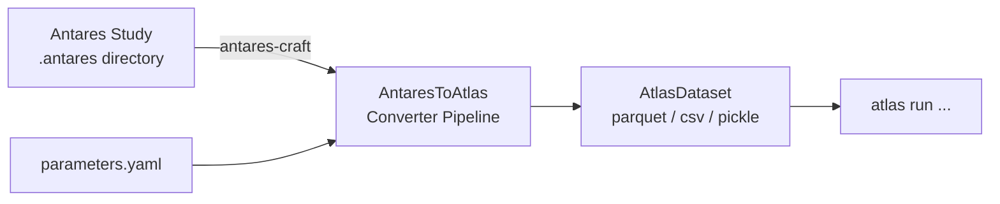

# Antares Integration

Atlas can convert an [Antares](https://antares-simulator.org/) study directly into an Atlas-ready dataset using the `antares-to-atlas` command. This page explains what that means, why it matters, and where to go next.

## What is Antares?

Antares is a power system simulator developed by RTE and widely used across Europe for long-term capacity adequacy and energy policy studies. A typical Antares study holds several years of hourly time-series data for dozens of European countries — thermal fleets, hydro, renewables, load, interconnections, and Monte-Carlo output files.

## Why integrate Antares with Atlas?

Atlas simulates short-run electricity markets (day-ahead, intraday, reserves). Its input format is highly structured: typed business objects, time-series, and scenario matrices. Building that input from scratch for a large European study is complex and error-prone.

The `antares-to-atlas` converter bridges the two worlds:

- **Reuse existing studies**: turn a validated Antares model into Atlas inputs without manual data entry.
- **Consistency**: the conversion is deterministic and reproducible — same study + same parameters = same Atlas dataset every time.
- **Hypothesis support**: the converter handles study-specific conventions (e.g. BP23 cluster naming, mixed-fuel groups, nuclear modulation) through a pluggable hypothesis mechanism.
- **Selective conversion**: run only the converters you need via tags or explicit step lists, making partial updates fast.

## How it works

The converter reads the Antares study with [`antares-craft`](https://github.com/AntaresSimulatorTeam/antares-craft), applies an ordered pipeline of typed converters (one per equipment category), and writes an `AtlasDataset` that any Atlas module can consume directly.

## Converted equipment

The standard converter pipeline covers:

| Equipment | Converter |
|-----------|-----------|
| Nodes, market areas, portfolios, control blocks | `SystemStructureConverter` |
| Load demand | `LoadConverter` |
| Wind (onshore + offshore) | `WindConverter` |
| Solar PV | `SolarConverter` |
| Run-of-river & reservoir hydro | `HydroConverter` |
| Thermal clusters (all fuel types) | `ThermalConverter` |
| Other non-dispatchable | `NonDispatchableConverter` |
| Inter-area links | `LinkConverter` |
| Battery storage | `BatteryConverter` |
| Closed-loop PHS | `PHSClosedConverter` |

Additional converters are activated when `hypothesis: BP23` is set (electric vehicles, open-loop PHS, mixed fuels, P2G, multi-energy, DSR, nuclear modulation, water values, and more).

## Documentation

-   :material-book-open-variant:{ .lg .middle } **User Guide**

    ---

    CLI commands, parameters file reference, converter filtering, and a complete worked example.

    [:octicons-arrow-right-24: User guide](user-guide.md)

-   :material-console:{ .lg .middle } **CLI Reference**

    ---

    All `atlas antares-to-atlas` sub-commands documented in the full CLI reference.

    [:octicons-arrow-right-24: CLI reference](../cli.md#atlas-antares-to-atlas)

