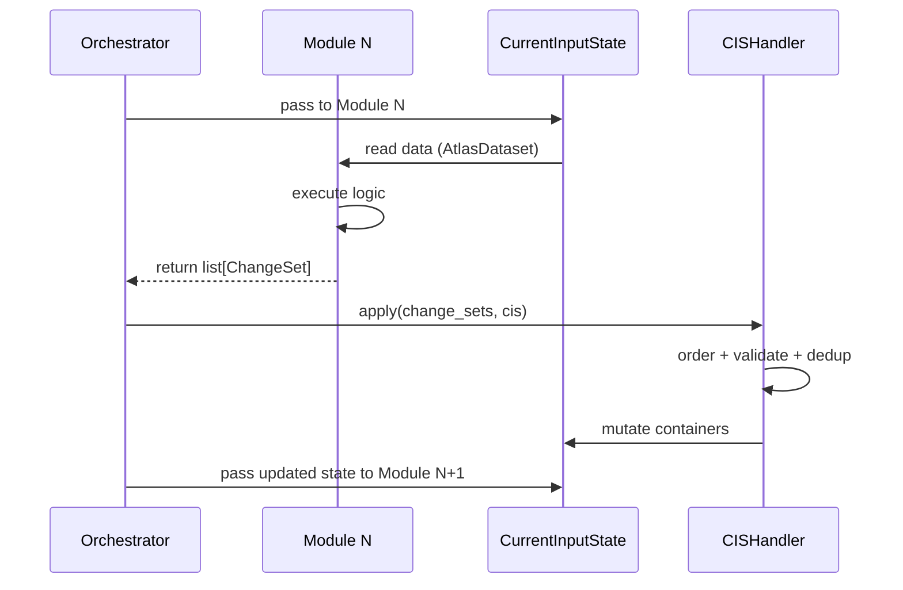

# Data Flow & Orchestration

This page explains how data moves between modules at runtime. Understanding this is essential before implementing a new module or debugging unexpected state.

## The Three Actors

| Actor | Role |
|---|---|
| [`CurrentInputState`](../api/orchestrator/current_input_state.md) | Shared mutable state — wraps an `AtlasDataset` and is passed sequentially to every module. |
| [`ChangeSet`](../api/orchestrator/change_set.md) | Immutable description of one mutation (`AddObject`, `UpdateObject`, `DeleteObject`). Modules produce lists of these — they never write to the CIS directly. |
| [`CISHandler`](../api/orchestrator/cis_handler.md) | The only component that applies ChangeSets to the CIS. Handles ordering, duplicate detection, and transactional rollback. |

## Execution Flow



1. The orchestrator passes the CIS to the current module.
2. The module reads data from `cis.data` (the underlying `AtlasDataset`) through its `InputDataset`.
3. The module executes its logic and populates its `OutputDataset`, then calls `build_change_sets()`.
4. The orchestrator calls `CISHandler.apply(change_sets, cis)`.
5. `CISHandler` orders the change sets (dependency order), detects duplicates, then delegates each to `ChangeSetHandler.apply()`.
6. The updated CIS is passed to the next module.

## Why ChangeSets?

Modules must not modify the CIS directly. Using ChangeSets enforces:

- **Isolation** — a module's side effects are explicit and auditable.
- **Rollback** — if a batch partially fails, `CISHandler` restores the affected containers atomically.
- **Ordering** — `CISHandler` reorders mutations to respect `ControlBlock → MarketArea → Node/Portfolio → Equipment` dependency order, regardless of the order modules produce them.

## ChangeSet Types

```python
from atlas.orchestrator.change_set import AddObject, UpdateObject, DeleteObject

# Add a new object
AddObject({"name": "new_thermal", "node": "node_fr", ...}, Thermal)

# Update fields on an existing object
UpdateObject({"name": "thermal_1", "da_power": timeseries}, Thermal)

# Remove an object by name
DeleteObject("thermal_old", Thermal)
```

All three require a `"name"` key. References to other business objects can be passed as strings (resolved automatically against the CIS) or as object instances.

## Snapshot & Rollback

`CurrentInputState` supports named snapshots for debugging or manual rollback:

```python
cis.create_snapshot("before_module_3")

# ... apply changes ...

# Something went wrong — restore
cis.restore_snapshot("before_module_3")

# Or inspect what changed
diff = cis.diff(label="before_module_3")
print(diff["thermal"]["modified"])  # ['thermal_1', 'thermal_2']
```

For transactional safety within a single batch, `CISHandler` uses `cis.transaction()` internally — the affected containers are backed up cheaply (only the touched types, not the entire dataset) and restored on any error.

## Implementing a Module: Checklist

- [ ] `InputDataset.__init__` — extract from `AtlasDataset`, never hold a reference to the CIS itself.
- [ ] `OutputDataset.build_change_sets()` — emit `UpdateObject` / `AddObject` / `DeleteObject` for every mutated object.
- [ ] Never call `CISHandler` or `ChangeSetHandler` from inside a module — the orchestrator does this.
- [ ] Use module-specific wrapper objects (`input_objects/`) to add computed properties; don't mutate the raw business objects during `import_data`.

See [Implementing a Module](implementing-a-module.md) for the full step-by-step guide.
